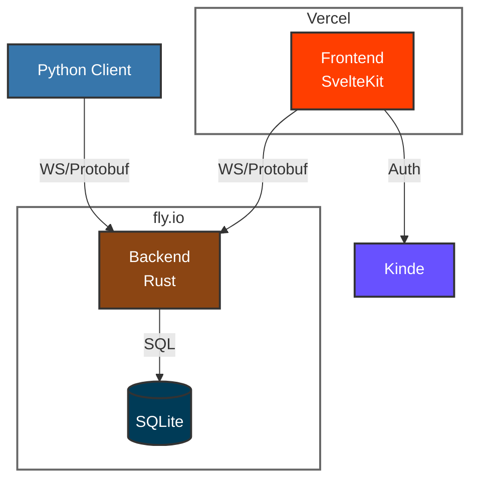

# System Design

<em>Architecture</em>

## Design Decisions

### WebSocket

[WebSocket](https://developer.mozilla.org/en-US/docs/Web/API/WebSockets_API) is a widely supported protocol for real-time communication. Messages are guaranteed to be delivered in order, enabling reliable state aggregation using patch messages. To support request-response style communication, the client may add a request ID to each message. The server will respond with a message containing the same request ID, and the client can match responses to requests.

### Protobuf

[Protobuf](https://protobuf.dev/) is a binary serialization protocol and schema definition language. Schemas are defined in `.proto` files, and can be compiled to many languages. It provides a binary format that is smaller in size and faster to parse, strong typing with built-in validation, and backwards compatibility for evolving APIs over time.

### Rust

[Rust](https://www.rust-lang.org/) is very reliable, making it a good choice for avoiding bugs and crashes in the exchange. Using [tokio](https://tokio.rs/), it can also scale up to many concurrent connections and very high throughput while using less resources.

### SQLite

[SQLite](https://www.sqlite.org/) is a C library that provides a very simple and lightweight disk-based database. While it only allows a single concurrent writer, this shouldn't matter much since most activity is expected to happen on a small set of markets. For comparison, Postgres would in practice allow concurrency up to the number of active markets. Since SQLite's single threaded performance is higher, I estimate we would need to have at least ~100 active markets before Postgres would be faster.

### Svelte

[Svelte](https://svelte.dev/) is nicer to work with that React IMO. It's also faster (especially svelte-5), making it a good choice when we expect the state to change very quickly. My main regret here is that less students will be familiar with it and thus able to edit the frontend.

### Fly.io

[Fly.io](https://fly.io/) is a cloud platform that allows convenient deployment from dockerfiles. They have data centers in many locations, auto-scaling down to 0, and fast start-up times. It should be noted that rust deployment can take a few minutes, and inevitably causes live connections to be interrupted.

### Bot Client

The python client is optimized for having a simple and type safe API, while allowing more complex use cases. It lets the user get the current state, and transparently uses the request-response pattern to let requests look synchronous. Making clients in more languages should be straightforward, as many languages support protobuf and websockets.

### Kinde

[Kinde](https://kinde.com/) is a convenient way to handle authentication and user management, and their free tier supports up to ~10k monthly active users.
